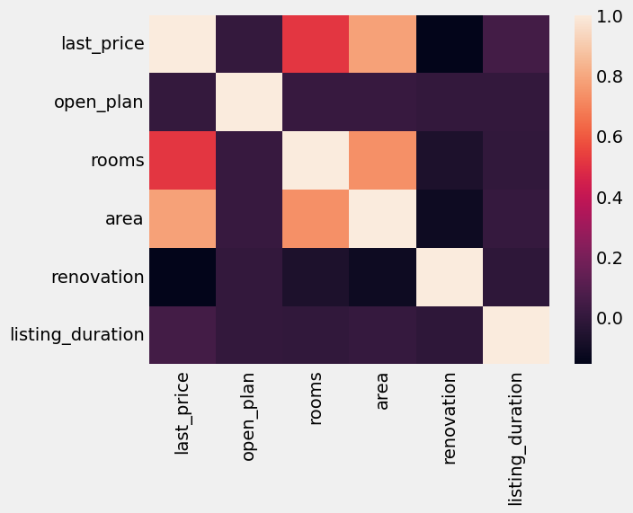

# Machine Learning Project for Real Estate Listings

We have data from Yandex.Realty classified Yandex.Realty (https://realty.yandex.ru/) containing real estate listings for apartments in St. Petersburg and Leningrad Oblast from 2016 till the middle of August 2018. In this Lab, you'll learn how to apply machine learning algorithms to solve business problems. Accurate price prediction can help to find fraudsters automatically and help Yandex.Realty users make better decisions when buying and selling real estate.

## Data Overview

The cleaned and prepared dataset contains the following features:

- last_price
- open_plan
- rooms
- area
- renovation
- last_price_log
- listing_duration

Here is an example of the data:

| last_price | open_plan | rooms | area | renovation | last_price_log | listing_duration |
|------------|------------|-------|------|------------|----------------|------------------|
| 20000.0    | 0          | 1     | 28.0 | 3.0        | 9.903488       | 360              |
| 24000.0    | 0          | 2     | 59.0 | 3.0        | 10.085809      | 108              |
| 18000.0    | 0          | 1     | 36.0 | 3.0        | 9.798127       | 159              |
| 18000.0    | 0          | 1     | 39.0 | 0.0        | 9.798127       | 24               |
| 19000.0    | 0          | 1     | 36.0 | 11.0       | 9.852194       | 34               |

### Statistics

- Rent median price: 25000.0
- Rent mean price: 32605.09

- Sell median price: 4599000.0
- Sell mean price: 6969288.15

### Correlation Heatmap



## Model and Framework

### Model Information

Several models were tested, including Decision Tree and Random Forest. However, Gradient Boosting model was selected because it performed the best based on our evaluation metrics.

#### Metrics for Gradient Boosting Model

- MAE (Mean Absolute Error): 0.356
- MSE (Mean Squared Error): 0.341
- RMSE (Root Mean Squared Error): 0.584

### Chosen Framework

- Framework: Scikit-learn

### Hyperparameters

- random_state: 42

## Installation and Running Instructions

To install and run the application in a virtual environment, follow these steps:

1. Download and install Visual Studio Code from the official website (https://code.visualstudio.com/).

2. Create and activate a virtual environment by running the following commands in your terminal:

        python3 -m venv env
        source env/bin/activate
    

3. Install the required libraries. The project uses several libraries, with a notable emphasis on the specific version of Scikit-learn. Install the dependencies using the following command:

        pip install -r requirements.txt
    

4. Run the application. Once the environment is set up and the dependencies are installed, you can run the Flask application using:

        python3 app.py

## Dockerfile information

A Dockerfile is available for supporting a containerized environment for the project. The Dockerfile includes the following parameters:

```
FROM ubuntu:22.04
MAINTAINER iadogot
RUN apt-get update -y
COPY . /opt/gsom_e2esmp
WORKDIR /opt/gsom_e2esmp
RUN apt install -y python3-pip
RUN pip3 install -r requirements.txt
CMD python3 app.py
```

## Port Configuration

The application uses port **7778**.
It can be changed in the last rows of the file.

## App via Docker

Use the following commands:

1. Push the Docker image to the repository:
```sh
docker push iadogot/gsom_e2esmp:v.0.4
```

2. Run the Docker container:
```sh
sudo docker run —network host -d iadogot/gsom_e2esmp:v.0.4
```
